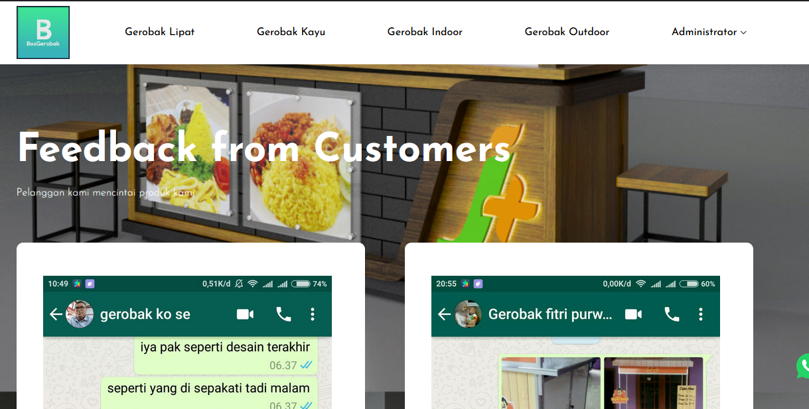
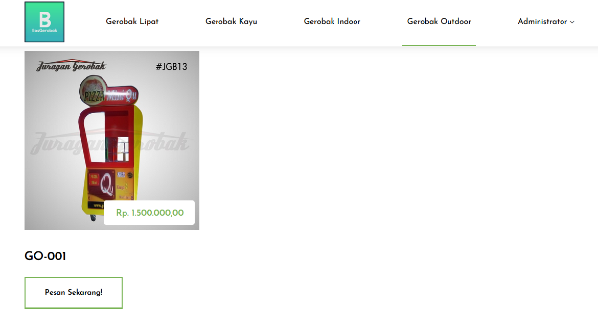
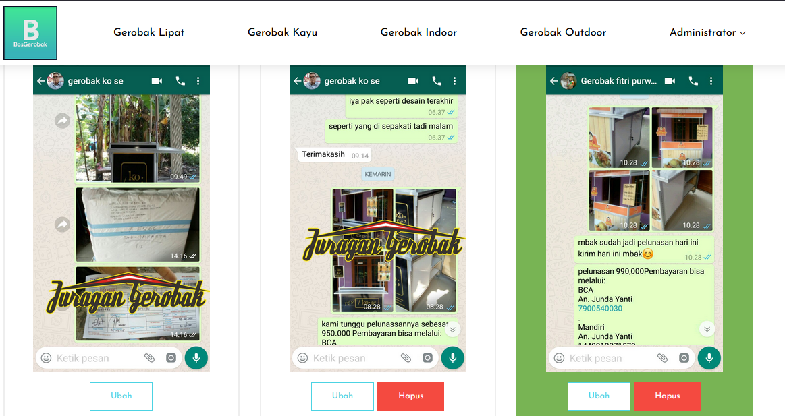

## APLIKASI ECCOMERCE PENJUALAN ETALASE / GEROBAK

## PROJECT INI DI BUAT MENGGUNAKAN LARAVEL DAN MYSQL UNTUK DATABASE NYA

## STEP BY STEP

-   CLONE https://github.com/Arfiyan19/Ecomerce-Etalase-Gerobak---Laravel.git

-   composer install
-   setting .env
-   php artisan key:generate
-   php artisan storage:link
-   php artisan migrate --seed

## administrator

email : admin@bosgerobak.com
password : admin@bosgerobak.com

## Tampilan

<h2> Menu Login </h2>  

   

<h2> Menu Home </h2>  

   

<h2> Menu List Gerobak Kayu </h2>  

   

<h2> Menu Gerobak Lipat </h2>  

   

<h2> Menu List Gerobak Indoor </h2>  

   

<h2> Menu List Gerobak Outdoor </h2>  

   

<h2> Menu Kategory </h2>  

   

<h2> Menu List Testimoni </h2>  

   
